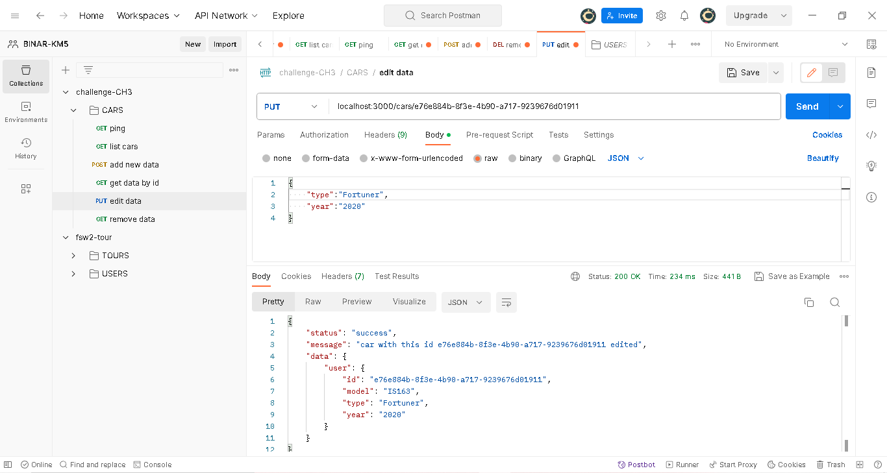

1. Request ke endpoint root
   

2. Request ke endpoint list cars untuk mengambil daftar car
   

3. Request ke endpoint get data by id untuk mengambil satu data car berdasarkan id
   

4. Request ke endpoint edit data untuk mengupdate data dari satu car berdasarkan id
   

5. Request ke endpoint add new data untuk menambahkan car
   

6. Request ke endpoint remove data untuk menghapus data dari satu car berdasarkan id
   
